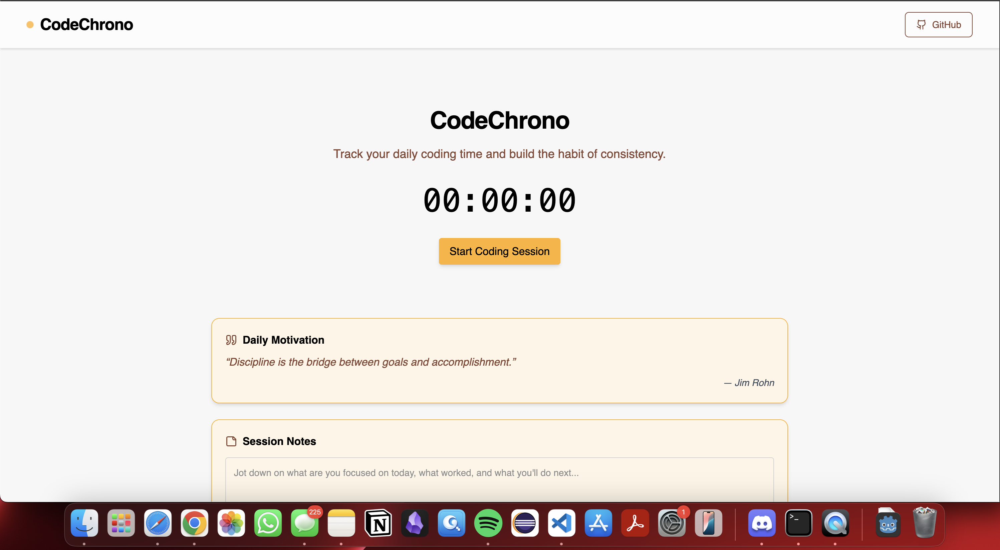

# CodeChrono – My Daily Coding Session Logger

CodeChrono is a personal productivity app that helps me log my daily coding time, track progress, and stay consistent. It's designed for developers who want to build strong habits, stay motivated, and visualize their growth over time.

## Live Demo



[https://code-chrono.vercel.app/](https://code-chrono.vercel.app/)

---

## Features

- Track daily coding time in minutes
- Heatmap calendar visualization of coding streaks
- Daily goal setting and progress tracking
- Write and save session notes per day
- Badge unlock system for hitting milestones
- Weekly and monthly coding summaries
- Export data as JSON or CSV
- Motivational quotes that rotate with time
- Modern, responsive UI with animations

---

## Tech Stack

- React.js
- Tailwind CSS
- Framer Motion
- Lucide React Icons
- Vite
- LocalStorage for state and persistence
- Deployed with Vercel

---

## Getting Started

To run this project locally:

```
git clone https://github.com/asifrahman2003/CodeChrono
cd frontend
npm install
npm run dev
Project Structure
less
Copy
Edit
frontend/
├── components/         // Reusable UI components
├── utils/              // LocalStorage helpers and date utilities
├── App.jsx             // Main App layout
├── index.css           // Tailwind base styles
└── main.jsx            // App entry point
```

## Future Improvements
- cloud sync and authentication
- PWA support for mobile use
- Built-in Pomodoro timer
- User leaderboard
- Browser extension integration

## Author
Asifur Rahman
- Portfolio: https://www.iamasiff.com
- LinkedIn: https://linkedin.com/in/iamasiff
- GitHub: https://github.com/asifrahman2003

## License
This project is licensed under the MIT License.